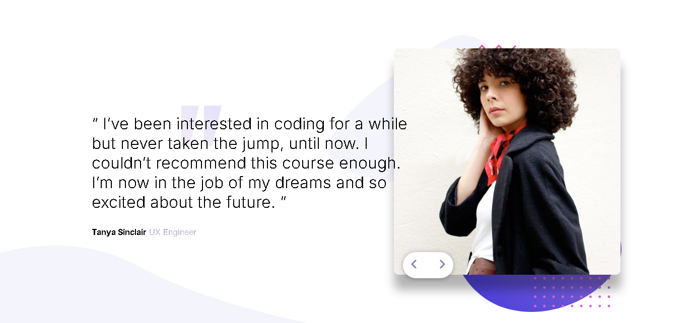

# Frontend Mentor - Coding bootcamp testimonials slider solution

This is a solution to the [Coding bootcamp testimonials slider challenge on Frontend Mentor](https://www.frontendmentor.io/challenges/coding-bootcamp-testimonials-slider-4FNyLA8JL). Frontend Mentor challenges help you improve your coding skills by building realistic projects. 

## Table of contents

- [Overview](#overview)
  - [The challenge](#the-challenge)
  - [Screenshot](#screenshot)
  - [Links](#links)
- [My process](#my-process)
  - [Built with](#built-with)
  - [What I learned](#what-i-learned)
  - [Continued development](#continued-development)
  - [Useful resources](#useful-resources)
- [Author](#author)

## Overview

### The challenge

Users should be able to:

- View the optimal layout for the component depending on their device's screen size
- Navigate the slider using either their mouse/trackpad or keyboard

### Screenshot



### Links

- Solution URL: [ GitHub ](https://github.com/WellissonLima/coding-bootcamp-testimonials-slider/)
- Live Site URL: [ Slide ](https://wellissonlima.github.io/coding-bootcamp-testimonials-slider/)

## My process

### Built with

- Semantic HTML5 markup
- CSS custom properties
- Flexbox
- CSS Grid

### What I learned

The use and positioning of multiple images in a background was a challenge, it was the first time doing a styling like this, but it gave me a new perspective to work with front end.

```css
.slider-container .slide {
  background-image: url("../images/pattern-bg.svg"), url("../images/pattern-curve.svg"), url("../images/pattern-quotes.svg");
    background-repeat: no-repeat, no-repeat, no-repeat;
    background-position: right 130px top 70px, left bottom, left 360px top 210px;
    background-size: 580px 550px, auto, 80px 80px;
}
```

## Author

- Website - [Wellisson Lima](https://www.your-site.com)
- Frontend Mentor - [@WellissonLima](https://www.frontendmentor.io/profile/WellissonLima)
- LinkedIn - [@WellissonBoanerges](https://www.linkedin.com/in/wellissonboanergesbarroslima/)